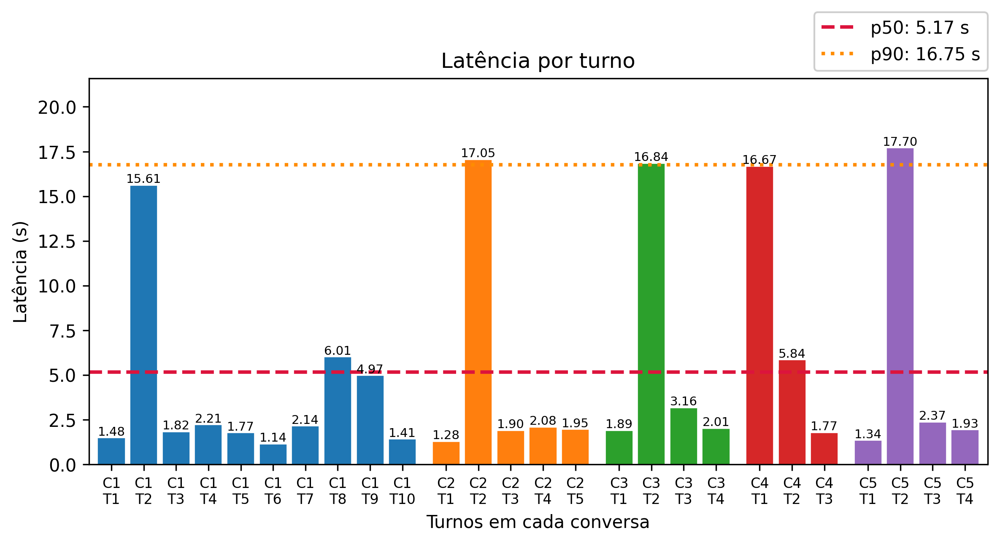

# Relatório de métricas de conversas

Gerado pelo notebook `real_estate_agent/notebooks/conversation_metrics.ipynb`.

## 1. Visão geral do conjunto de dados

- **Número de conversas:** 5
- **Modelos utilizados:** gemini-2.5-flash
- **Total de tokens utilizados:** 100.424
- **Total de turnos (conversas):** 26
- **Latência média:** 5.17 s

- **Total de mensagens por agente (`role`):**
  - `planner_agent`: 34
  - `user`: 26
  - `research_agent`: 5
  - `pricing_agent`: 2

## 2. Latência

