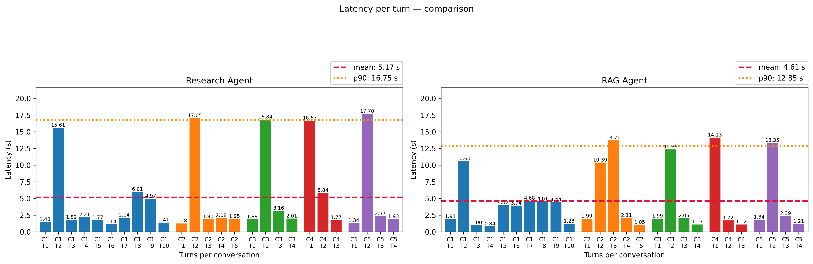

# Conversation metrics report

**TL;DR.** This report compares the **RAG Agent** and the **Research Agent** (the Research Agent uses Google web search) on the same five conversations and model (`gemini-2.5-flash`).

**LLM-judge:** Both approaches **score** very similarly: strong **correctness** and **clarity**, aligned **completeness**, with **slightly lower usefulness for the RAG Agent**.

**Runtime & cost:** The **RAG Agent** is **faster on average**. Its **p90 latency** is **23.3% lower** than the Research Agent's (turn-level, this sample). **Total tokens** for the RAG Agent are **+23.4%** relative to the Research Agent.

**Bottom line:** There is no clear quality winner; prefer **RAG** if latency matters most, **Research** if you want to **cut token usage**.

---

Comparison between `Research Agent` and `RAG Agent` (detail in the tables below).

## 1. Overview — comparison

| Metric | Research Agent | RAG Agent |
| --- | ---: | ---: |
| Number of conversations | 5 | 5 |
| Total tokens | 100.424 | 123.933 |
| Total turns | 26 | 26 |
| Mean latency (s) | 5.17 | 4.61 |
| P90 latency (s) | 16.75 | 12.85 |
| Model class | gemini-2.5-flash | gemini-2.5-flash |

### Messages by `role`

| role | Research Agent | RAG Agent |
| --- | ---: | ---: |
| `planner_agent` | 34 | 37 |
| `pricing_agent` | 2 | 5 |
| `rag_agent` | 0 | 6 |
| `research_agent` | 5 | 0 |
| `user` | 26 | 26 |

## 2. Latency

## 3. Qualitative evaluation (LLM as judge)

| Criterion | Research Agent | RAG Agent |
| --- | ---: | ---: |
| Correctness | 5.00 | 5.00 |
| Completeness | 4.00 | 4.00 |
| Clarity | 5.00 | 5.00 |
| Usefulness | 4.60 | 4.40 |
| Overall score | 4.65 | 4.60 |
